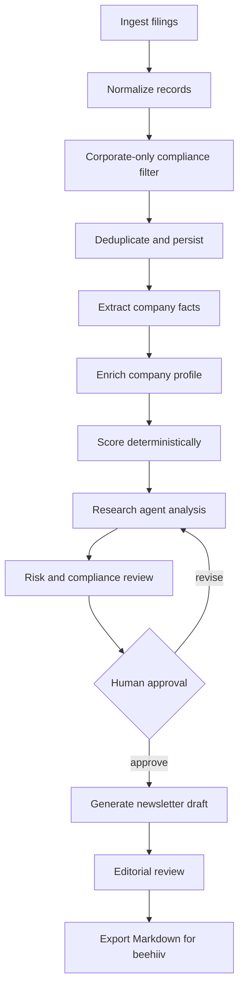

# Agentic Implementation Plan

**Date:** 2026-06-15
**Status:** Architecture proposal for Phase 0-2

**Reality check:** A separate working implementation already exists at `/Users/ghassan/my-projects/insolvency-scout`. It scrapes the `neu.insolvenzbekanntmachungen.de` JSF portal, stores filings in DuckDB, has deterministic filter/enrichment/classification stages, exposes an MCP server, and was run by OpenClaw automation. Treat it as a reference implementation and historical data source, not as code to copy into this repo.

---

## Critical Assessment

The current strategy is directionally strong: the product value is curation and ranked intelligence, not scraping. The documents also make the right early call to validate manually before building a large automated system.

The main risk is over-automating too early. Insolvency opportunity scoring combines public facts, weak signals, legal sensitivity, and subjective commercial judgment. A fully autonomous agent that scrapes, scores, writes, and publishes would create accuracy, defamation, GDPR, and financial-advice risk. The correct architecture is **agent-assisted intelligence with deterministic controls and human approval**.

The second risk is treating the score as objective. The v1 model is useful, but it will look more precise than it really is unless every score has evidence, confidence, and reviewer notes. The score should be framed as an editorial prioritization score, not a valuation or investment recommendation.

The third risk is source fragility and pipeline observability. The existing `insolvency-scout` scraper already proves the official portal can be queried, but its current data shows duplicate company/date rows and incomplete run logging. The new system should learn from those results while implementing a cleaner production pipeline from first principles.

The fourth risk is compliance drift. Consumer insolvencies, individual names, director data, and administrator contacts need explicit handling rules. The system should not rely on prompts alone for these boundaries.

---

## Recommended Architecture

Use **LangGraph from v0** for orchestration and durable workflow state, **LangChain** for model/tool integrations and structured outputs, and ordinary Python modules for deterministic business logic.

LangGraph is appropriate because this workflow is stateful, multi-step, interruptible, and human-reviewed. LangChain is appropriate for structured extraction, summarization, drafting, and model/tool wrappers. The scoring formula, source filtering, deduplication, data retention, and publishing gates should stay outside the LLM.

Use the existing `insolvency-scout` database as a compatibility input and migration source. The production scraper, storage model, scoring, editorial review, and issue generation should live in this repo with clean boundaries. Do not copy old code blindly; reimplement only the behavior we intentionally choose after reviewing the old system's data and failure modes.

### Design Principle

```
Agents suggest.
Code verifies.
Humans approve.
Logs remember.
```

---

## Workflow Graph



---

## Agent Roles

### 1. Ingestion Coordinator

**Type:** mostly deterministic

Responsibilities:
- Load manual CSV/JSON records in Phase 1 when needed.
- Read historical filings from `/Users/ghassan/my-projects/insolvency-scout/data/insolvency_scout.duckdb` through a read-only compatibility adapter.
- Run the new repo-owned official-portal scraper once implemented.
- Optionally call third-party APIs only if source coverage or reliability demands it.
- Store source URL, source timestamp, court, case number, raw notice text, and retrieval method.

Do not use an LLM for ingestion decisions.

### 2. Entity Extraction Agent

**Type:** LangChain structured output

Responsibilities:
- Extract company name, legal form, court, case number, filing date, administrator, proceeding stage, sector hints, and location.
- Return structured JSON with confidence per field.
- Preserve the raw source link and evidence snippets.

This agent should never decide whether a record is publishable. It only extracts candidate facts.

### 3. Compliance Filter

**Type:** deterministic with optional LLM explanation

Responsibilities:
- Reject likely consumer/personal insolvencies.
- Keep only allowed legal forms: GmbH, AG, UG, KG, OHG, GmbH & Co. KG, eG, SE, Ltd branches where relevant.
- Flag risky records containing private individuals, sole proprietors, unclear legal form, or missing source URL.

This must be implemented as code, not prompt policy.

### 4. Enrichment Agent

**Type:** agentic, tool-using

Responsibilities:
- Use approved enrichment sources such as OpenRegister, company websites, public register data, and manually supplied notes.
- Estimate company scale bands where evidence exists.
- Identify sector, assets, contracts, brand, IP, operating status, and likely acquirer profile.

Every enriched claim must cite a source or be marked as inference.

### 5. Scoring Engine

**Type:** deterministic

Responsibilities:
- Calculate score from explicit dimension inputs.
- Store dimension values, weights, reviewer, timestamp, and score version.
- Support weight changes through config.

The LLM may propose dimension scores, but the final score must be written by deterministic code after human acceptance.

### 6. Research Analyst Agent

**Type:** LangGraph node using LangChain tools

Responsibilities:
- Write a short opportunity thesis.
- Explain why the company might interest acquirers, creditors, recruiters, or advisors.
- Produce buyer-fit tags.
- Assign confidence and missing-information notes.

This is where agentic reasoning creates value, but it must be grounded in the normalized record and enrichment evidence.

### 7. Risk Reviewer Agent

**Type:** structured review agent

Responsibilities:
- Detect unsupported claims, financial-advice language, defamatory wording, stale facts, and personal-data leakage.
- Confirm each public claim has a source or is clearly marked as editorial inference.
- Require a disclaimer before export.

This agent should block drafts, not silently rewrite them.

### 8. Newsletter Draft Agent

**Type:** controlled generation

Responsibilities:
- Generate free and paid Markdown versions.
- Use the existing newsletter template.
- Include source links, score badges, confidence notes, and disclaimer.

Output should be a draft only. No autonomous publishing in Phase 1-2.

---

## State Model

The graph state should be explicit and auditable.

```python
class FilingRecord(BaseModel):
    id: str
    source_url: str
    source_name: str
    retrieved_at: datetime
    raw_text: str
    court: str | None
    case_number: str | None
    filing_date: date | None

class CompanyProfile(BaseModel):
    name: str
    legal_form: str | None
    city: str | None
    sector: str | None
    proceeding_stage: str | None
    administrator: str | None
    evidence: list[Evidence]
    extraction_confidence: float

class ScoreInput(BaseModel):
    company_value: int
    asset_quality: int
    sector_attractiveness: int
    speed_of_action: int
    legal_risk: int
    rationale: dict[str, str]
    reviewer_status: Literal["proposed", "approved", "rejected"]

class OpportunityDraft(BaseModel):
    profile: CompanyProfile
    score: float
    category: str
    thesis: str
    key_risk: str
    action_step: str
    confidence: Literal["low", "medium", "high"]
    missing_information: list[str]
```

---

## Repository Shape

Recommended Python-first structure:

```text
berlin-insolvency-radar/
  src/
    biradar/
      agents/
        extraction.py
        enrichment.py
        analyst.py
        risk_review.py
        newsletter.py
      graph/
        workflow.py
        state.py
        checkpoints.py
      sources/
        base.py
        manual.py
        insolvenz_radar.py
        official_portal.py
      scoring/
        model.py
        weights.yaml
      compliance/
        filters.py
        retention.py
      output/
        beehiiv_markdown.py
      storage/
        models.py
        repository.py
  data/
    manual/
    exports/
  tests/
    fixtures/
    unit/
    evals/
```

---

## Build Plan

### Phase 0: Existing Data Audit And Migration

Goal: learn from the existing `insolvency-scout` system without making this repo depend on its code.

Build:
- Read-only `LegacyScoutImportProvider` that reads DuckDB records into the radar state model.
- Deduplication by company name, court, case number/raw register text, and publication date.
- Run health report based on actual `filings.scraped_at` because `scrape_log` is currently empty for the Berlin pipeline script.
- Optional migration of legacy filings into the new schema with `legacy_source_id` and `legacy_imported_at`.
- Mapping from its 0-100 `asset/talent/timing/fit` score into an archived legacy-score field. Do not treat it as the production newsletter score.
- A clear source-quality status: `raw_candidate`, `deduped_candidate`, `review_ready`, `publish_ready`.

Known current-state findings from local inspection:
- Codebase: `/Users/ghassan/my-projects/insolvency-scout`
- DB: `/Users/ghassan/my-projects/insolvency-scout/data/insolvency_scout.duckdb`
- Latest observed scrape: `2026-06-10T08:00:04`
- Rows: 311 filings, 260 scores
- Distinct company/date pairs: 63
- OpenClaw system cron: no user crontab; OpenClaw is loaded via launchd and stores internal cron jobs in `/Users/ghassan/.openclaw/state/openclaw.sqlite`
- Active matching OpenClaw job: none for the daily pipeline; only disabled `insolvency-scout-progress`
- Historical issue: June 10 pipeline was killed during enrichment around 21/51 records

Exit criteria:
- Duplicates do not appear in newsletter candidate lists.
- A stale-ingestion warning appears if no fresh scrape happened within 26 hours.
- The new system can explain whether each candidate came from legacy import, manual entry, or the new scraper.

### Phase 1: New Production Core

Goal: build the production-grade foundation fresh in this repo.

Build:
- Manual CSV/JSON input schema.
- New database schema for filings, source runs, normalized entities, evidence, scores, reviews, and issue drafts.
- Repo-owned DuckDB database at `data/radar.duckdb`.
- Minimal LangGraph workflow for import -> dedupe/filter -> review -> score -> draft/export.
- Deterministic corporate-only filter.
- Deterministic scoring engine.
- Markdown issue generator.
- DuckDB storage for local analytics, legacy compatibility, and simple deployment. Keep repository boundaries clean enough to move to Postgres later if multi-user writes become real.
- Human review checklist in the generated draft.
- Read-only legacy import command for comparison and backfill.

Agent usage:
- Optional extraction from pasted notice text.
- Draft opportunity thesis.
- Risk-review draft language.

Do not build:
- Autonomous publishing.
- Unreviewed real-time alerts.
- Long-running OpenClaw-owned product state.

Build only a small scraper spike if needed to prove the new source abstraction and test fixtures.

Exit criteria:
- 3 issues produced.
- Each opportunity has source, score rationale, and human approval.
- Subscriber and reply metrics justify deeper automation.
- Legacy data can be imported or queried without running the old pipeline.

### Phase 2: New Official Portal Scraper

Goal: implement a clean scraper in this repo with production standards.

Build:
- Official portal source adapter for `neu.insolvenzbekanntmachungen.de`.
- Deterministic request lifecycle, retries, timeout handling, and structured parse errors.
- Source-run records for every scrape attempt.
- Stable deduplication before insert.
- Fixtures from saved HTML/result samples.
- Tests for parsing, date normalization, legal-form extraction, empty results, portal errors, and duplicate handling.

Use the old scraper only as a behavioral reference and test oracle. Do not run it alongside the new production scraper once this phase is active.

Exit criteria:
- New scraper produces the same or better candidate coverage as the legacy DB for a sampled historical date window.
- Every run has a source-run record and error status.
- Running the scraper repeatedly is idempotent.
- Old `insolvency-scout` jobs remain disabled.

### Phase 3: Agent-Assisted Drafting

Goal: reduce manual research and writing time while preserving editorial control.

Build:
- LangGraph workflow with checkpointing.
- Structured extraction agent.
- Analyst agent.
- Risk reviewer agent.
- Human interrupt before final draft export.
- LangSmith tracing or equivalent observability for agent runs.

Exit criteria:
- Draft generation is faster than manual writing.
- No consumer records pass the filter in tests.
- Risk reviewer catches seeded unsupported claims.

### Phase 4: API Ingestion

Goal: add Insolvenz-Radar only if the new scraper cannot provide reliable coverage.

Build:
- Insolvenz-Radar source adapter behind `SourceProvider`.
- Scheduled ingestion job.
- Deduplication by source, court, case number, company name, and filing date.
- Retry and error logging.
- Data retention policy enforcement.

Exit criteria:
- Weekly pipeline can produce a ranked candidate list from API records.
- Human review still required before export.
- Source outage does not corrupt existing issue data.

### Phase 5: Premium Alerts

Goal: introduce high-signal alerts without flooding subscribers.

Build:
- Subscriber alert criteria model.
- Alert scoring threshold.
- Human approval for alert templates at first.
- Sector and geography filters.

Critical note:
Real-time alerts increase liability because the product starts to look operational rather than editorial. Legal review should happen again before this phase.

Do not build:
- Autonomous publishing.
- Unreviewed real-time alerts.

---

## Test Strategy

### Unit Tests

- Score formula and category thresholds.
- Corporate legal-form allowlist.
- Consumer/person rejection patterns.
- Deduplication keys.
- Markdown rendering.

### Golden Fixtures

Maintain fixtures for:
- GmbH filing.
- GmbH & Co. KG filing.
- Sole proprietor / individual filing that must be rejected.
- Ambiguous company name requiring review.
- Missing source URL.
- Duplicate record from two sources.

### Agent Evals

Create small evaluation sets for:
- Extraction accuracy.
- Unsupported-claim detection.
- Risk-language rewriting.
- Newsletter format compliance.

Agents should be evaluated on structured outputs, not vibes.

---

## Key Product Corrections

1. Rename "Opportunity Score" in public copy to "Editorial Opportunity Score" or "Radar Score" to avoid sounding like investment advice.
2. Add confidence level and missing-information notes to every top opportunity.
3. Require at least one source link per published opportunity.
4. Keep individual director names out of free issues unless a lawyer confirms the policy.
5. Treat administrator contact details as premium/reviewed data, not casual public copy.
6. Make scoring versioned from day one.
7. Keep the first three issues manual, but build the manual pipeline in the same shape as the automated system.

---

## Suggested First Implementation Ticket

Build the new production core plus a read-only legacy import command.

Acceptance criteria:
- `biradar import-legacy-scout --since 2026-06-01` imports or indexes records from `/Users/ghassan/my-projects/insolvency-scout/data/insolvency_scout.duckdb` without mutating the legacy DB.
- Duplicate company/date records collapse to one candidate in the new system.
- `biradar ingest-manual data/manual/week-001.json` validates and stores records.
- `biradar score --week 2026-W25` calculates deterministic scores from approved dimensions.
- `biradar draft --week 2026-W25 --tier free` exports Markdown.
- Consumer filings are rejected with a clear reason.
- Tests cover scoring, filtering, deduplication, stale-ingestion detection, and Markdown output.

This gives the project a real product pipeline without copying the legacy implementation, pretending the agent can safely replace editorial judgment, or running two production pipelines at the same time.
