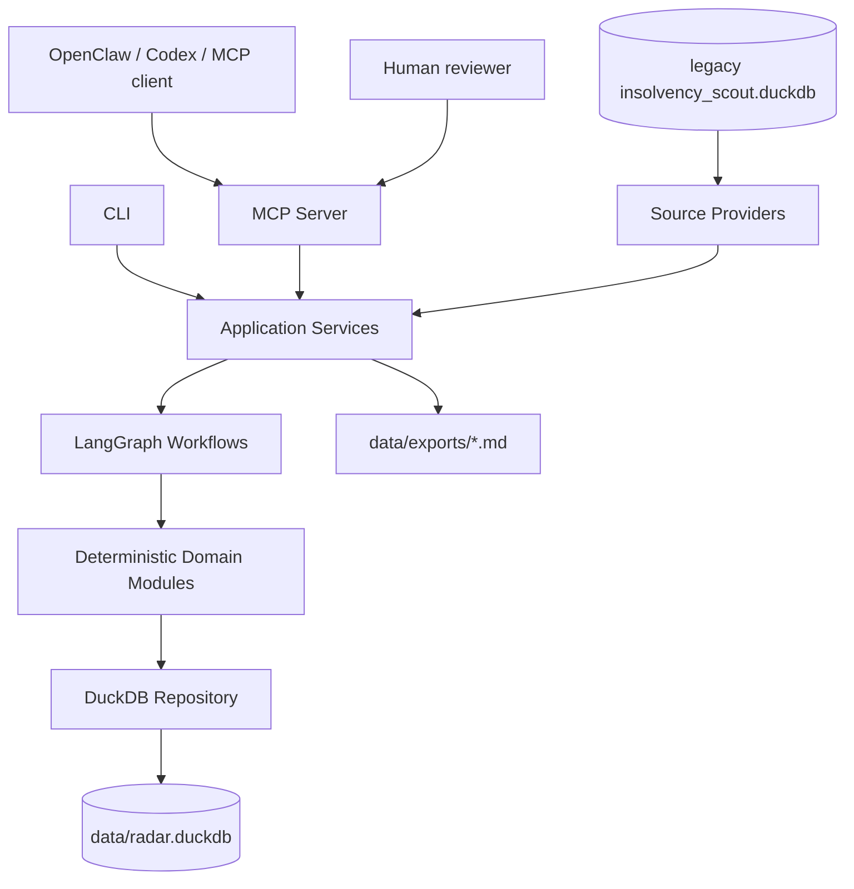
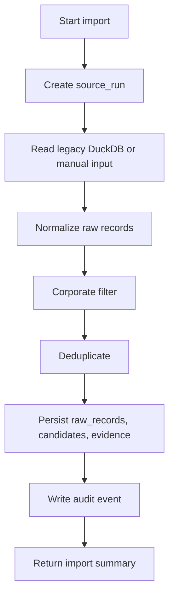
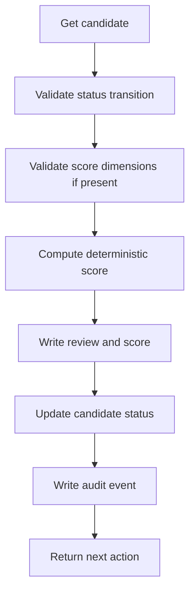
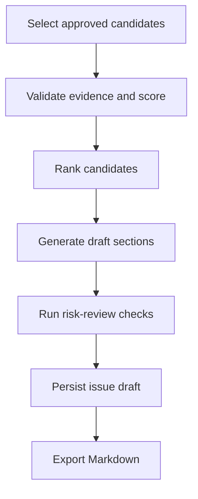

# Application Architecture

**Date:** 2026-06-15
**Status:** Target design for MCP v0 and production evolution

---

## Executive Summary

Berlin Insolvency Radar should be built as a local-first, MCP-first intelligence system.

The application should not be "a scraper with AI attached." It should be a source-governed editorial intelligence platform where every candidate, score, claim, and draft can be traced back to evidence.

The recommended architecture is:

```text
MCP tools / CLI
    -> application services
    -> LangGraph workflows
    -> deterministic domain modules
    -> DuckDB repository
    -> local exports
```

OpenClaw and other agents interact only through MCP. DuckDB is the local source of truth. LangGraph coordinates workflow state and human review. Deterministic Python modules enforce compliance, deduplication, scoring, and audit.

---

## Design Goals

### Product Goals

- Produce a weekly ranked list of corporate insolvency opportunities.
- Preserve human editorial control.
- Make every public claim evidence-backed, confidence-scored, or explicitly marked as inference.
- Keep consumer/personal insolvencies out of the product workflow.
- Let OpenClaw operate the system without knowing database paths or internals.

### Engineering Goals

- Small v0, serious foundations.
- Typed inputs and outputs at every boundary.
- Deterministic core behavior with agentic assistance around extraction, research, and drafting.
- Re-runnable imports and idempotent workflows.
- Full audit trail for every state-changing action.
- Local-first operation with a clear path to hosted or multi-user architecture later.

### Non-Goals For v0

- No autonomous publishing.
- No external email sends.
- No unreviewed alerts.
- No long-running OpenClaw-owned state.
- No scraper rewrite before the MCP core is usable.
- No copying old `insolvency-scout` code.

---

## Architecture Principles

```text
Agents suggest.
Code verifies.
Humans approve.
Logs remember.
```

### 1. MCP Is The Product Boundary

OpenClaw, Codex, local scripts, and future agents should all use the same stable MCP contract. If an operation matters, it should be exposed as a typed tool or backed by the same service used by a typed tool.

### 2. DuckDB Owns Local Product State

DuckDB is the source of truth for v0:

- `data/radar.duckdb` for repo-owned state.
- Legacy `/Users/ghassan/my-projects/insolvency-scout/data/insolvency_scout.duckdb` is production data owned by the old project and is read-only input only.
- All state-changing writes go through repository services.
- For v0, serialize writes through the MCP server or CLI process.

For experimentation, clone the legacy DB to an explicit snapshot path such as `data/legacy_snapshots/` or a temp directory. Never use the live legacy DB as this repo's working database.

DuckDB is the right default because this is a local analytical workflow with evidence tables, ranking, exports, and legacy DuckDB compatibility. If the product later needs many concurrent users or hosted writes, move repository implementations to Postgres without changing domain services.

### 3. LangGraph Coordinates, It Does Not Decide Policy

LangGraph should orchestrate the workflow from v0, but the graph should call deterministic modules for:

- corporate-only filtering
- deduplication
- scoring
- retention
- audit writes
- export gates

LLM nodes may extract, summarize, draft, and critique. They should not be the final authority on whether a record is legal, publishable, or scored.

### 4. Evidence Is More Important Than Text

The system should store evidence before it stores polished language. Newsletter prose is replaceable. Evidence, provenance, and review decisions are the asset.

### 5. Every Write Is Audited

Any tool or workflow that changes state must create an audit event with actor, action, input summary, affected entity, timestamp, and result.

---

## Runtime Components



### MCP Server

Responsible for:

- exposing v0 tools
- validating inputs with typed schemas
- returning consistent result envelopes
- mapping exceptions to actionable errors
- enforcing write safety and dry-run behavior

The MCP server should be thin. It should delegate business behavior to application services.

### Application Services

Responsible for use cases:

- health reporting
- legacy import
- candidate listing/detail
- review decisions
- score approval
- issue draft creation
- export
- audit retrieval

Services should be callable from MCP tools and CLI commands.

### LangGraph Workflows

Responsible for orchestration:

- import workflow
- candidate preparation workflow
- candidate review workflow
- issue draft workflow

LangGraph state should contain IDs and workflow context, not large raw blobs. Durable facts belong in DuckDB.

### Domain Modules

Responsible for pure or mostly pure logic:

- compliance filters
- dedupe keys and matching
- scoring calculation
- status transitions
- issue selection rules
- retention rules

These modules should be heavily unit tested.

### Source Providers

Responsible for reading data from:

- manual JSON/CSV
- legacy `insolvency-scout` DuckDB
- future official portal scraper
- future commercial APIs

Providers return normalized source records and evidence candidates. They do not write product state directly.

### DuckDB Repository

Responsible for:

- schema migrations
- insert/upsert/query operations
- audit event writes
- analytical reporting queries
- exportable snapshots

Keep SQL centralized. Domain code should not build ad hoc SQL across the codebase.

---

## Recommended Repository Structure

```text
berlin-insolvency-radar/
  pyproject.toml
  README.md
  docs/
  src/
    biradar/
      __init__.py
      mcp/
        server.py
        tools.py
        schemas.py
        envelope.py
      cli/
        main.py
      config/
        settings.py
        sources.yaml
        scoring.yaml
      graph/
        state.py
        workflows.py
        import_workflow.py
        review_workflow.py
        draft_workflow.py
        checkpoints.py
      services/
        health.py
        import_legacy.py
        candidates.py
        reviews.py
        issues.py
        audit.py
      domain/
        compliance.py
        dedupe.py
        scoring.py
        statuses.py
        retention.py
      agents/
        extraction.py
        analyst.py
        risk_review.py
        newsletter.py
        prompts/
      sources/
        base.py
        manual.py
        legacy_scout.py
        official_portal.py
        insolvenz_radar.py
        insolvenz_index.py
      storage/
        db.py
        migrations/
        repository.py
        queries.py
      output/
        markdown.py
        beehiiv.py
      observability/
        logging.py
        tracing.py
        metrics.py
  data/
    radar.duckdb
    manual/
    exports/
    fixtures/
  tests/
    unit/
    integration/
    fixtures/
    evals/
```

---

## DuckDB Data Model

The v0 schema should be normalized enough to support evidence and audit, but not so abstract that the first build slows down.

### Core Tables

#### `source_providers`

Configured data sources.

Key fields:

- `source_id`
- `name`
- `kind`
- `trust_level`
- `enabled`
- `config_json`
- `created_at`
- `updated_at`

#### `source_runs`

Every import or scrape attempt.

Key fields:

- `source_run_id`
- `source_id`
- `run_type`
- `status`
- `started_at`
- `completed_at`
- `params_json`
- `records_seen`
- `records_imported`
- `duplicates`
- `rejected`
- `error_json`

#### `raw_records`

Raw imported source records.

Key fields:

- `raw_record_id`
- `source_run_id`
- `source_id`
- `external_id`
- `retrieved_at`
- `source_url`
- `raw_text`
- `raw_json`
- `content_hash`
- `parser_version`

#### `candidates`

Deduped product candidates.

Key fields:

- `candidate_id`
- `canonical_company_name`
- `legal_form`
- `court`
- `case_number`
- `register_number`
- `publication_date`
- `publication_type`
- `status`
- `source_quality`
- `risk_flags_json`
- `created_at`
- `updated_at`

Recommended statuses:

```text
raw_candidate
deduped_candidate
needs_review
review_ready
publish_ready
rejected
archived
duplicate
quarantined
```

#### `candidate_sources`

Links candidates to raw source records.

Key fields:

- `candidate_id`
- `raw_record_id`
- `match_confidence`
- `match_reason`

#### `evidence_items`

Field-level evidence for claims and extracted facts.

Key fields:

- `evidence_id`
- `candidate_id`
- `source_provider`
- `source_url`
- `retrieved_at`
- `field`
- `value`
- `confidence`
- `trust_level`
- `snippet`
- `content_hash`

#### `scores`

Editorial scoring records.

Key fields:

- `score_id`
- `candidate_id`
- `score_version`
- `company_value`
- `asset_quality`
- `sector_attractiveness`
- `speed_of_action`
- `legal_risk`
- `computed_score`
- `category`
- `rationale_json`
- `status`
- `reviewer`
- `created_at`
- `approved_at`

#### `reviews`

Human or agent review events for candidates.

Key fields:

- `review_id`
- `candidate_id`
- `reviewer`
- `decision`
- `from_status`
- `to_status`
- `note`
- `created_at`

#### `issues`

Newsletter issue drafts.

Key fields:

- `issue_id`
- `week`
- `tier`
- `status`
- `title`
- `draft_markdown`
- `created_by`
- `created_at`
- `exported_at`
- `export_path`

#### `issue_candidates`

Candidates included in an issue.

Key fields:

- `issue_id`
- `candidate_id`
- `rank`
- `section`
- `included_score_id`

#### `audit_events`

Append-only audit log.

Key fields:

- `audit_id`
- `actor`
- `action`
- `entity_type`
- `entity_id`
- `request_json`
- `result_json`
- `created_at`

---

## LangGraph Workflows

### v0 Import Workflow



Required behavior:

- dry-run must not write candidates
- legacy DB must never be mutated
- legacy DB should be opened read-only and verified unchanged in acceptance tests
- duplicate groups must be reported
- consumer/personal records must be rejected or quarantined

### v0 Review Workflow



Required behavior:

- one call can approve, reject, request more info, archive, or mark duplicate
- score values must be bounded integers
- final score formula must be deterministic
- every status change must be audited

### v0 Issue Draft Workflow



Required behavior:

- no candidate without approved score and evidence should appear
- free tier should include only allowed fields
- administrator contact details should be suppressed in free output until legal review
- export writes local Markdown only

---

## MCP v0 Contract

The first MCP surface should stay intentionally small:

| Tool | Service | Workflow |
|---|---|---|
| `radar_health` | `HealthService` | none |
| `radar_import_legacy_scout` | `LegacyImportService` | import workflow |
| `radar_list_candidates` | `CandidateService` | none |
| `radar_get_candidate` | `CandidateService` | none |
| `radar_review_candidate` | `ReviewService` | review workflow |
| `radar_create_issue_draft` | `IssueService` | issue draft workflow |
| `radar_export_issue` | `IssueService` | export step |
| `radar_audit_trail` | `AuditService` | none |

All tools return:

```json
{
  "ok": true,
  "data": {},
  "warnings": [],
  "errors": [],
  "audit_id": "audit_..."
}
```

Agent-friendly requirements:

- every result should include `next_action` when useful
- list endpoints should default to work queues, not raw dumps
- error messages should be short, stable, and actionable
- dry-run should be available on imports and future acquisitions
- state-changing tools should include actor/reviewer

---

## Application Services

### `HealthService`

Returns:

- DB connectivity
- schema version
- candidate counts by status
- latest source run
- stale source warnings
- disabled old-pipeline warning if check is implemented
- recommended next action

### `LegacyImportService`

Responsibilities:

- open legacy DuckDB read-only
- map old filings and scores into new candidate/evidence model
- dedupe repeated company/date rows
- preserve legacy score as archived reference only
- write source run, raw records, candidates, evidence, audit

### `CandidateService`

Responsibilities:

- list candidates by review queue
- return candidate detail with evidence, scores, reviews, source links
- hide/quarantine sensitive personal data by default

### `ReviewService`

Responsibilities:

- validate status transitions
- apply review decision
- compute approved score when score input is present
- store reviewer note
- write audit event

### `IssueService`

Responsibilities:

- select approved candidates
- rank by approved score and editorial rules
- create free/paid Markdown drafts
- enforce output gates
- export local files under `data/exports/`

### `AuditService`

Responsibilities:

- return audit events by entity, actor, action, or time range
- explain candidate lineage from raw source to issue draft

---

## Quality Standards

The detailed engineering standard lives in `strategy/testing-and-coding-standards.md`. The summary below captures the minimum architecture-level bar.

### Code Quality

- Python 3.12+
- `pyproject.toml` with explicit dependencies
- type hints everywhere in application code
- Pydantic models for external/tool/workflow inputs and outputs
- repository pattern for all DuckDB access
- no hidden global DB connections in domain logic
- deterministic modules should be pure where possible

Recommended tools:

```text
ruff
mypy or pyright
pytest
pytest-cov
duckdb
pydantic
langgraph
langchain
fastmcp or official MCP Python SDK
```

### Testing Standard

Minimum v0 tests:

- score formula and thresholds
- legal-form allowlist
- consumer/personal rejection patterns
- dedupe exact and fuzzy cases
- legacy import dry-run
- legacy import idempotency
- candidate review status transitions
- audit writes for every state-changing tool
- issue draft excludes unapproved candidates
- export creates stable Markdown

Golden fixtures:

- GmbH filing
- UG filing
- GmbH & Co. KG filing
- individual debtor that must be quarantined
- duplicate legacy records
- ambiguous legal form requiring review

### Observability

Every run should answer:

- What ran?
- Who triggered it?
- What source records were seen?
- How many candidates changed?
- What was rejected or quarantined?
- What evidence supports this candidate?
- Why did this candidate get this score?
- What appeared in an issue?

Use structured JSON logs and audit rows. Add LangSmith or equivalent tracing once LLM nodes are active.

### Security And Compliance

Hard rules:

- no consumer/personal insolvency publication
- no external publish/send in v0
- no public claim without evidence or marked inference
- no direct agent writes to the database
- no source credentials in repo
- no administrator contact details in free output until legal review
- no old and new production pipelines running concurrently

Privacy defaults:

- suppress first names, birth dates, private addresses, and personal debtor details
- quarantine ambiguous records
- retain raw personal-risk records only as long as needed for review, then purge according to retention policy

---

## Configuration

Use typed config files:

### `config/scoring.yaml`

```yaml
version: v1
weights:
  company_value: 0.25
  asset_quality: 0.20
  sector_attractiveness: 0.20
  speed_of_action: 0.20
  legal_risk: -0.15
thresholds:
  hot: 3.0
  solid: 2.5
  interesting: 2.0
```

### `config/sources.yaml`

```yaml
sources:
  legacy_scout:
    kind: duckdb_legacy
    enabled: true
    path: /Users/ghassan/my-projects/insolvency-scout/data/insolvency_scout.duckdb
    trust_level: C
  official_insolvency_berlin:
    kind: official_jsf
    enabled: false
    url: https://neu.insolvenzbekanntmachungen.de/ap/suche.jsf
    trust_level: A
```

---

## Phased Build

Detailed Phase 0 and Phase 1 acceptance tests live in `strategy/phase-acceptance-tests.md`. The bullets below are the build summary.

### Phase 0: Skeleton And Schema

Build:

- Python package
- DuckDB repository and migrations
- config loading
- audit event helper
- MCP server skeleton
- `radar_health`

Done when:

- MCP server starts
- `radar_health` reports DB path, schema version, and next action
- tests run locally

### Phase 1: Legacy Import And Review

Build:

- read-only legacy DuckDB provider
- import workflow
- candidate list/detail
- review workflow
- scoring engine
- audit trail

Done when:

- legacy import dry-run and real import work
- duplicates collapse
- candidate review writes score, status, and audit event

### Phase 2: Draft And Export

Build:

- issue draft workflow
- Markdown renderer
- export tool
- output gates

Done when:

- approved candidates can produce a local Markdown issue
- unapproved or quarantined candidates cannot be exported

### Phase 3: Fresh Official Portal Source

Build:

- repo-owned official portal adapter
- source-run tracking
- parser fixtures
- idempotent acquisition

Done when:

- sampled historical windows match or improve on legacy coverage
- old pipeline remains disabled

### Phase 4: Agentic Research And Drafting

Build:

- extraction agent
- analyst agent
- risk-review agent
- LangGraph human interrupt
- tracing/evals

Done when:

- drafts are faster to produce
- seeded unsupported claims are blocked
- no consumer records pass tests

---

## Critical Engineering Decisions

### DuckDB Now, Postgres Later Only If Needed

Use DuckDB for v0 because it matches the local analytical nature of the product. Design repository interfaces so Postgres can be introduced later if hosted multi-user writes become necessary.

### LangGraph From v0, But Minimal

Use LangGraph to avoid building a pile of ad hoc scripts. Keep the first graph simple and deterministic. Add LLM-heavy nodes only after evidence, review, and export are solid.

### MCP First, CLI Second, UI Later

The first interface is MCP because agents are the primary operators. CLI should call the same services for debugging and manual operation. A web UI can come later without changing the core.

### Old Scraper As Reference, Not Dependency

The old system is useful because it proves feasibility and provides legacy data. It should not dictate the new architecture or continue running beside it.

---

## Definition Of Best In Class For This Project

Best in class does not mean biggest architecture. For this product it means:

- the smallest workflow that can be trusted
- clear evidence for every output
- boring deterministic controls where risk is high
- agentic help where judgment and language matter
- one state owner
- one audit trail
- one MCP contract
- no hidden parallel systems
